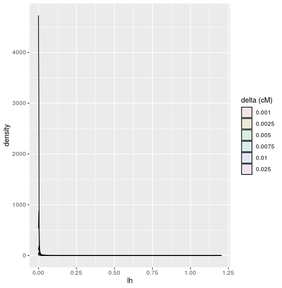
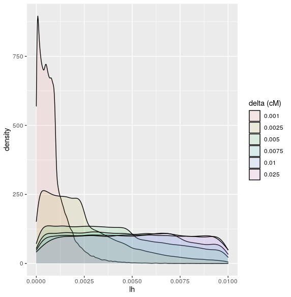
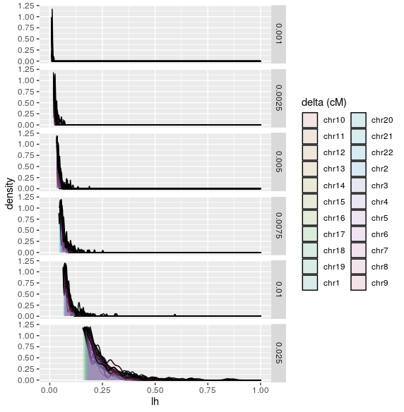
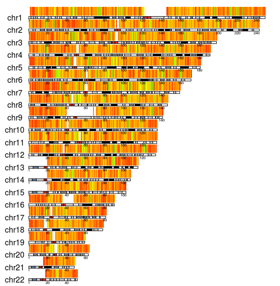

```{r, include = FALSE}
knitr::opts_chunk$set(
  collapse = TRUE,
  comment = "#>"
)
```

```R
library(gwhap)
```

# Haplotype blocs distribution per delta
haplotype blocs distribution for multiple values of delta
```R
# load the blocs
load('/home/ym257837/workspace/R_workspace/khra/gwhap/ressource/winDF_all.Rdata')
colnames(winDF) <- c("startW", "endW", "winsz", "fromBp", "toBp", "from_cm", "to_cm", "chr", "delta")

# plot
haplotype_block_distribution_per_deltas = haplotype_block_distribution(dfs_blocs)
print(haplotype_block_distribution_per_deltas)
```

results :


```R
haplotype_block_distribution_per_deltas = haplotype_block_distribution(dfs_blocs, xlim=c(1.590790e-10, 1e-02))
print(haplotype_block_distribution_per_deltas)
```
results :



# Haplotype blocs distribution per delta and per chromosome

```R
haplotype_block_distribution_per_chr = haplotype_block_distribution(dfs_blocs, xlim=c(1.590790e-10, 1), ylim=c(0, 1.2), per_chromosome=TRUE)
print(haplotype_block_distribution_per_chr)
```
results :



# karyoplote
```R
karyotype_plot_obj = karyotype_plot(df_blocs)
```

results :



